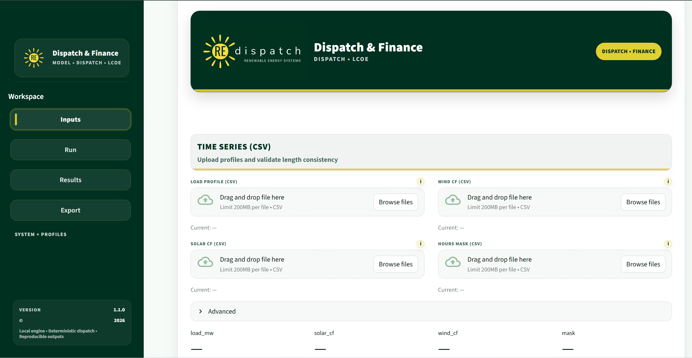
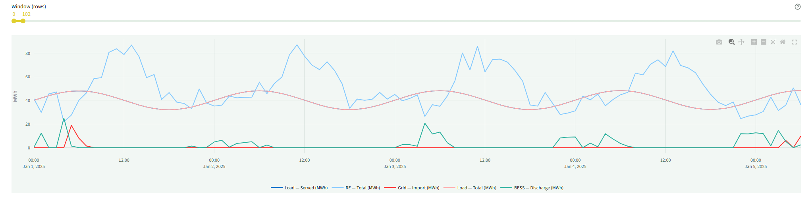
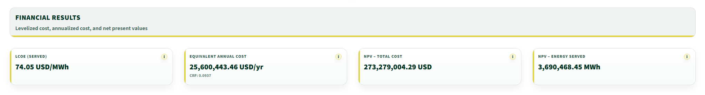

# REdispatch — Dispatch & Finance

Deterministic hourly dispatch and LCOE engine for renewable energy systems.

REdispatch — Dispatch & Finance is a standalone engineering module within the REdispatch suite. It performs deterministic hourly dispatch of Solar, Wind, Battery Energy Storage Systems (BESS), and Grid interactions over a representative year, then computes CAPEX, OPEX, replacements, discounting, Equivalent Annual Cost (EAC), and Levelized Cost of Energy (LCOE) based strictly on energy actually served to the load.

This module is designed for engineers, analysts, researchers, and developers who require reproducible, auditable technical and financial results.

---

## Core Capabilities

- Hourly dispatch simulation (typically 8760 hours)
- Solar / Wind / BESS / Grid interaction
- Explicit curtailment, export, and import modeling
- Minimum turndown and outage logic
- Backup-mode logic:
  - none
  - BESS-only
  - Grid-only
  - BESS-then-Grid
- Battery SOC tracking, throughput, and equivalent cycles
- Deterministic electrical loss chain (v1.1.0)
- CAPEX modeling (linear and scale-index)
- OPEX: component O&M, grid charges, time-block tariffs
- Replacement scheduling (BESS, inverters)
- NPV, EAC, and LCOE computed from served load

---

## Deterministic Philosophy

REdispatch does not rely on optimizers or stochastic solvers.

- Same inputs → same outputs
- No hidden assumptions
- No black-box behavior
- Explicit equations and balance tracking

The objective is traceability and reproducibility.

---

## Electrical Loss Chain (v1.1.0)

Version 1.1.0 introduces deterministic electrical loss modeling through a structured loss chain:

- Collection system losses
- Transformer losses
- Internal line losses
- Substation losses

Losses are applied as explicit multipliers per timestep.
Hourly and annual loss breakdowns are reported.
Energy balance integrity remains enforced.

---

## Screenshots

### Interface Overview

### Energy Flow Summary

### KPI and Financial Outputs

---

## Distribution

The full software package (source code, examples, documentation, and reference interface) is distributed separately under commercial license tiers.

This GitHub repository does not contain the executable source code.

Availability:
https://redispatchengine.com  
https://redispatch.gumroad.com

---

## License Tiers

The software is distributed under three license categories:

- Community (Non-Commercial)
- Professional (Internal Commercial)
- Commercial (Client Delivery + Hosting)

See official distribution page for full terms.

---

## Version

Current public release: v1.1.0

---

## Contact

For licensing or general inquiries:

redispatch.engine@gmail.com

---

REdispatch is a modular suite of deterministic engineering tools for renewable energy systems, PtX production, carbon accounting, and techno-economic evaluation.
